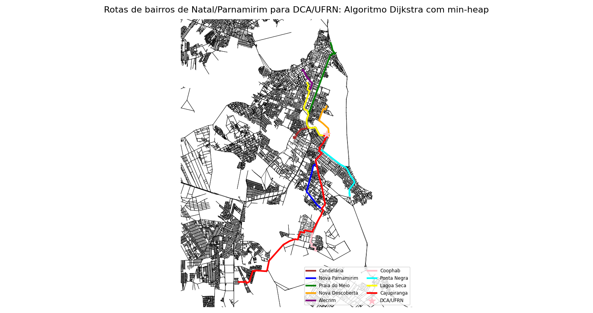
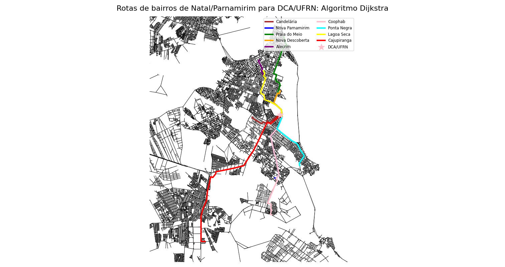
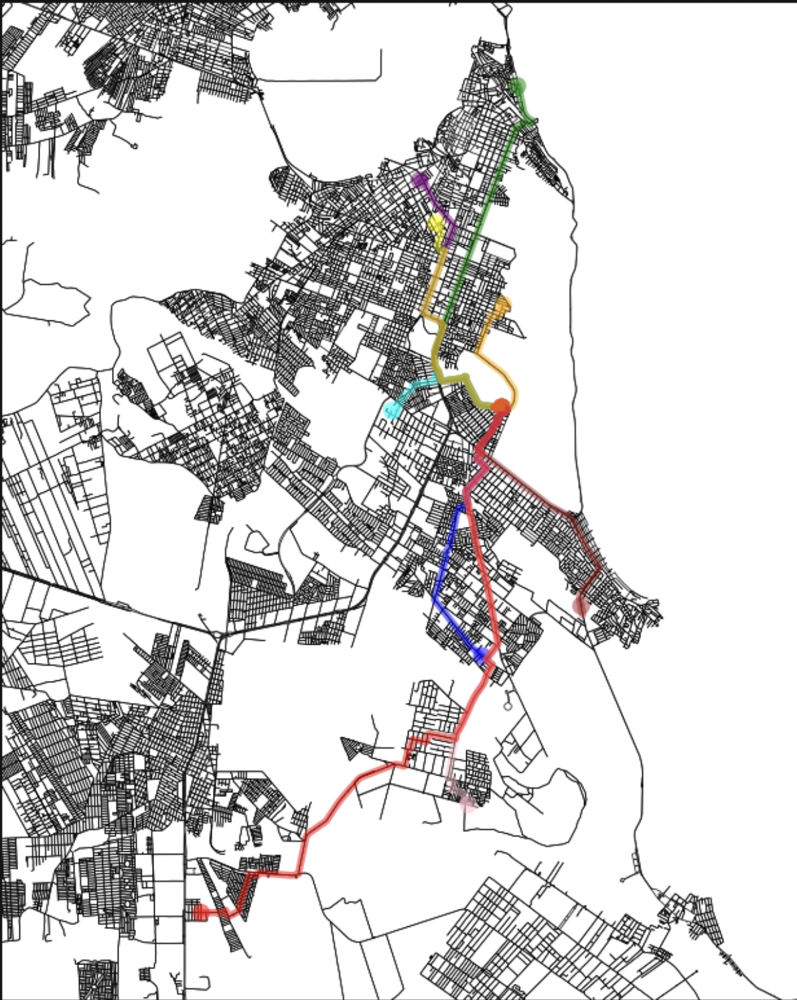

# Avaliação de Algoritmos para o Caminho Mais Curto em Grafos Urbanos

### Maria Eduarda Lima da Luz

**Matrícula:** 20250051776
**Curso:** Engenharia da Computação - UFRN

---

## Descrição do Trabalho

Link para vídeo no Youtube: https://youtu.be/C4Dv21YcHHA

Este repositório reúne a implementação e avaliação de três algoritmos de menor caminho aplicados ao cenário de deslocamento de estudantes de diferentes bairros de Natal/Parnamirim até o Departamento de Engenharia de Computação e Automação (DCA) da UFRN. O objetivo é comparar:

- **Distância percorrida** (km)
- **Tempo estimado** (min)
- **Pegada de carbono** (kg CO₂)
- **Desempenho computacional** (tempo de execução e consumo de energia)

Os algoritmos avaliados são:

1. **Dijkstra tradicional** (complexidade O(n²))
2. **Dijkstra otimizado com Min-Heap** (complexidade O((V+E)·log V))
3. **Roteamento via OSMnx**

---

## Cenário de Avaliação

Escolhi o cenário de **Acesso à UFRN a partir de diferentes bairros**, que corresponde ao trajeto diário que eu e meus amigos (morando cada um em um bairro distinto) fazemos para chegar às aulas no DCA/UFRN.

- **Origem fixa:** DCA/UFRN
- **Destinos múltiplos:** bairros: Candelária, Nova Parnamirim, Praia do Meio, Nova Descoberta, Alecrim, Coophab, Ponta Negra, Lagoa Seca e Cajupiranga

---

## Metodologia

1. **Obtenção do grafo viário** via OSMnx, com enriquecimento das arestas em `speed_kph` e `travel_time`.
2. **Implementação** dos algoritmos:

   - Dijkstra tradicional com matriz/adjacência.
   - Dijkstra com Min-Heap customizado, armazenando predecessores para reconstruir rotas.
   - Rotas diretas usando OSMnx.

3. **Medição de emissões** de CO₂ usando a biblioteca **CodeCarbon** durante a execução de cada algoritmo.
4. **Cálculo das métricas** (distância, tempo, emissões) e comparação em tabela.
5. **Visualização das rotas** com Matplotlib, destacando cada bairro e o ponto de chegada (DCA) no mapa.

---

## Tabela Comparativa de Resultados

| Bairro              | Dijkstra (Min-Heap)    | Dijkstra tradicional   | OSMnx                  |
| ------------------- | ---------------------- | ---------------------- | ---------------------- |
|                     | Dist ∣ Tempo ∣ CO₂     | Dist ∣ Tempo ∣ CO₂     | Dist ∣ Tempo ∣ CO₂     |
| **Candelária**      | 3.87 km ∣ 5.6 min ∣ —  | 3.87 km ∣ 6.2 min ∣ —  | 4.05 km ∣ 5.6 min ∣ —  |
| **Nova Parnamirim** | 6.77 km ∣ 9.0 min ∣ —  | 6.77 km ∣ 8.0 min ∣ —  | 7.78 km ∣ 9.0 min ∣ —  |
| **Praia do Meio**   | 9.43 km ∣10.1 min ∣ —  | 9.43 km ∣11.9 min ∣ —  | 9.60 km ∣10.1 min ∣ —  |
| **Nova Descoberta** | 3.33 km ∣ 4.8 min ∣ —  | 3.33 km ∣ 4.4 min ∣ —  | 3.71 km ∣ 4.8 min ∣ —  |
| **Alecrim**         | 7.16 km ∣ 7.7 min ∣ —  | 7.16 km ∣ 8.3 min ∣ —  | 7.38 km ∣ 7.7 min ∣ —  |
| **Coophab**         | 10.76 km ∣13.3 min ∣ — | 10.76 km ∣13.4 min ∣ — | 11.50 km ∣13.3 min ∣ — |
| **Ponta Negra**     | 6.25 km ∣ 7.5 min ∣ —  | 6.25 km ∣ 6.5 min ∣ —  | 7.32 km ∣ 7.6 min ∣ —  |
| **Lagoa Seca**      | 6.00 km ∣ 6.4 min ∣ —  | 6.00 km ∣ 6.8 min ∣ —  | 6.11 km ∣ 6.4 min ∣ —  |
| **Cajupiranga**     | 16.51 km ∣17.2 min ∣ — | 16.51 km ∣18.0 min ∣ — | 18.36 km ∣17.2 min ∣ — |

> Os valores de CO₂ estão disponíveis nos arquivos CSV na pasta `emissoes/`.

---

## Visualização das Rotas

### Dijkstra com Min-Heap



### Dijkstra Tradicional



### Roteamento OSMnx



---

## Estrutura do Repositório

```
├── algoritmos/
│   ├── dijkstras.py                   # Dijkstra tradicional
│   └── osmnxx.py                      # Setup e OSMnx routing
├── emissoes/
│   ├── dijkstras-min-heap.py         # Dijkstra com Min-Heap
│   ├── emissions-dijkstras-min-heap.csv
│   ├── emissions-dijkstras.csv
│   └── emissions-osmnx.csv
├── imagens/
│   ├── vizu-dijkstras-min-heap.png
│   ├── vizu-dijkstras.png
│   └── vizu-osmnx.png
├── powerMetrics/
│   ├── powermetrics-log-dijkstras-min-heap.txt
│   ├── powermetrics-log-dijkstras.txt
│   └── powermetrics-log-osmnx.txt
└── README.md                          # Descrição do projeto
```

---

> **Disciplina:** Algoritmos e Estruturas de Dados II - UFRN
> **Autor:** Maria Eduarda Lima da Luz

---
